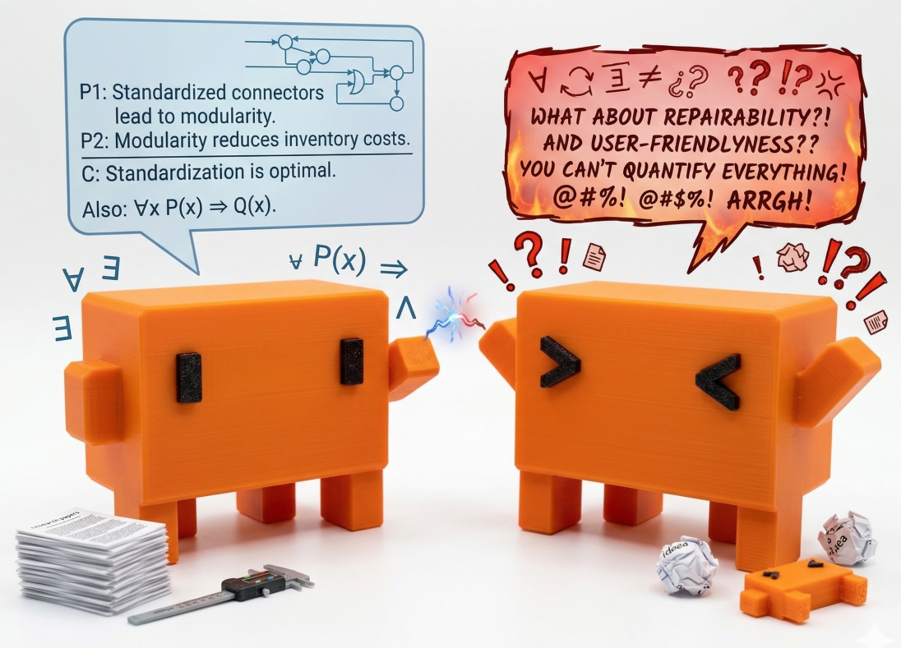

# Claude Code 辩论系统

[English](README_EN.md)



让两个 Claude Code 实例在 tmux 分屏中自动辩论。

```
┌─────────────────────────────────────────┐
│           📋  日志 / Log                 │
├───────────────────┬─────────────────────┤
│   ✅  正方 (PRO)   │   ❌  反方 (CON)    │
│                   │                     │
│  Claude Code 实例  │  Claude Code 实例   │
│                   │                     │
└───────────────────┴─────────────────────┘
```

## 工作原理

1. 启动脚本创建 tmux 分屏会话，在左右两个 pane 中各启动一个 Claude Code 实例
2. 正方先发言，完成后触发 **Stop hook** → 中继脚本提取回复，注入到反方 pane
3. 反方收到对方论点后回复，同样触发 Stop hook → 注入回正方
4. 如此轮流，达到指定轮次后双方各做最终总结，辩论结束

整个中继机制利用了 Claude Code 的 [Stop hook](https://docs.anthropic.com/en/docs/claude-code/hooks)：每当 Claude 完成回复，hook 自动触发 `relay.sh`，完成提取文本、更新状态、注入对方这一循环。

## 快速开始

### 前置条件

- [Claude Code CLI](https://docs.anthropic.com/en/docs/claude-code)（`claude` 命令可用）
- [tmux](https://github.com/tmux/tmux)
- [jq](https://jqlang.github.io/jq/)
- Python 3.8+

### 运行

```bash
# 经典模式：纯文本辩论
python3 debate_cc.py "人工智能弊大于利" 5

# 联网搜索模式：辩手可搜索数据、引用来源
python3 debate_cc.py "人工智能弊大于利" 5 --search
```

tmux 会自动打开，辩论实时进行。结束后按 **ESC** 退出。

## 两种模式

| | 经典模式 | 联网搜索模式 (`--search`) |
|---|---|---|
| 发言长度 | 100-150 字 | 150-200 字 |
| 工具使用 | 无 | 可用 WebSearch、Bash |
| 输出格式 | 直接输出论点 | 研究过程 + 【最终论点】标记 |
| 启动参数 | `--dangerously-skip-permissions` 否 | 是（允许工具调用） |

## 文件结构

```
cc-debate/
├── debate_cc.py        # 入口：初始化状态 + 启动 tmux 分屏
├── relay.sh            # 中继枢纽：Stop hook 触发时执行
├── extract_text.py     # 从 transcript 提取 assistant 回复
├── state/              # 运行时状态（gitignore）
│   ├── state.json      # 轮次、阶段、消息计数等
│   ├── pro/            # 正方工作目录
│   │   ├── .claude/settings.json  # Stop hook 配置
│   │   ├── system_prompt.txt      # 系统提示
│   │   └── start.py               # 启动脚本
│   └── con/            # 反方工作目录（结构同上）
└── YYYYMMDD_辩题/      # 辩论记录（自动生成）
    ├── 正方.md
    └── 反方.md
```

## 核心设计

- **Stop hook 作为 IPC** — 利用 Claude Code 的 hook 机制实现两个实例间的通信，无需额外消息队列
- **原子状态管理** — 通过 `state.json` + `jq` 原子更新，防止并发竞态
- **消息计数防重** — 记录已处理消息数，避免 Stop hook 重复读取同一条消息
- **重试机制** — thinking 块可能先于 text 块落盘，提取文本时最多重试 5 次
- **tmux 可视化** — 实时观看辩论过程，上方日志区显示中继状态

## 示例输出

运行 `python3 debate_cc.py "ai最后会战胜人类" 3` 后，在 `20260412_ai最后会战胜人类/` 目录下生成：

- **正方.md** — 正方每轮论点 + 最终总结
- **反方.md** — 反方每轮论点 + 最终总结

## 许可

**非商业使用许可 (CC BY-NC-SA 4.0)**

本项目采用 [Creative Commons Attribution-NonCommercial-ShareAlike 4.0 International](https://creativecommons.org/licenses/by-nc-sa/4.0/) 许可协议。

- 你可以自由使用、修改和分享本项目，**仅限非商业用途**
- 商业使用（包括但不限于付费产品、商业服务、企业内部部署）**必须获得作者授权**，并按双方协商的比例进行利润分成
- 侵权必究

如需商业授权，请联系项目作者。
